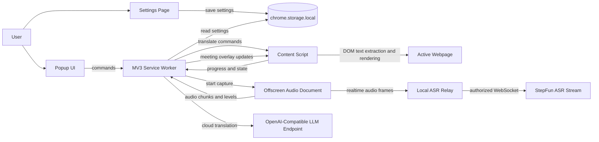
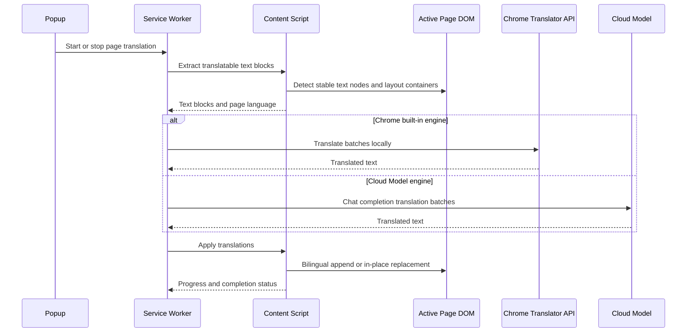
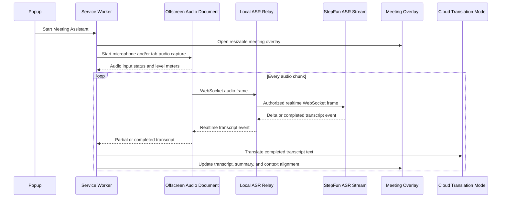
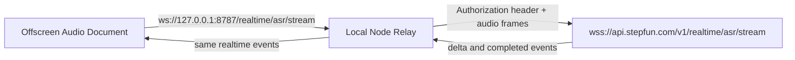

# Infron Translate

Infron Translate is a Chrome Manifest V3 extension for full-page webpage translation and live meeting assistance. It detects the source language of the current page, lets the user choose both source and target languages, and supports either bilingual comparison text or translation-only replacement.

The default extension UI language is Chinese. Users can switch the extension interface between Chinese and English from the popup or settings page.

## Features

- Detect the source language of the active webpage.
- Let users manually override the source language and target language.
- Translate full pages in two display modes:
  - **Bilingual**: keep original text and append the translation.
  - **Translation only**: replace source text in place without rebuilding the page DOM.
- Toggle translation manually from the popup.
- Enable or disable automatic page translation globally.
- Use a right-side floating logo button to toggle automatic page translation from any supported page.
- Choose the translation engine:
  - **Chrome built-in Translator API** for on-device translation.
  - **Cloud Model** for OpenAI-compatible providers.
- Configure Cloud Model providers:
  - OpenAI Compatible
  - Infron.ai
  - OpenRouter.ai
- Fetch model lists from provider `/v1/models` endpoints.
- Test Cloud Model connectivity from the settings status indicator.
- Show translation progress with an in-page progress panel.
- Translate dynamically added content from infinite scroll, dialogs, drawers, and open Shadow DOM.
- Cache repeated text translations to avoid duplicate requests.
- Pause translation per site from the popup.
- Configure inserted translation typography, color, background, and formatting.
- Start a meeting assistant from the popup:
  - Capture microphone input when permission is granted.
  - Request current-tab meeting audio through Chrome tab capture.
  - Show two full-screen panels on the current page: meeting outline and live transcript with translations.
  - Stream microphone and current-tab audio through a realtime ASR WebSocket pipeline.

## Architecture

The extension is split across standard Manifest V3 surfaces. The popup and options page manage user intent and configuration, the service worker coordinates long-running workflows, the content script owns page translation and overlays, and the offscreen document handles audio capture that cannot run directly inside the service worker.



### Page Translation Flow



### Meeting Assistant Flow



### Realtime ASR Relay

StepFun ASR Stream requires the WebSocket endpoint `wss://api.stepfun.com/v1/realtime/asr/stream` and an `Authorization: Bearer $STEPFUN_API_KEY` header. Browser `WebSocket` does not allow extensions to attach custom request headers, so Infron Translate uses a local relay for realtime ASR authentication.



## Installation

```bash
npm install
npm run build
```

Then load the extension in Chrome:

1. Open `chrome://extensions`.
2. Enable **Developer mode**.
3. Click **Load unpacked**.
4. Select the generated `dist/` directory.

## Usage

### Popup

Click the Infron Translate extension icon to open the popup. The popup shows:

- Current site hostname.
- Detected page language.
- Source language selector.
- Target language selector.
- Display mode selector.
- Translation engine selector.
- Automatic page translation switch.
- Site pause switch.
- Interface language selector.
- Meeting Assistant start button.

Use **Translate this page** to start or stop manual full-page translation.

Use **Start Meeting Assistant** during a video or voice meeting to open the live meeting overlay on the current tab.

### Meeting Assistant

The Meeting Assistant is designed for live calls where the user needs both a structured meeting outline and bilingual transcript view.

Current implementation:

- Starts from the extension popup.
- Opens a two-panel overlay on the active webpage.
- Uses an offscreen document for tab-audio capture setup.
- Shows microphone and system-audio capture state plus live input level meters in the overlay.
- Provides a Pre-meeting Material entry in the overlay for agenda, goals, planned strategy, risks, and expected outcomes.
- Cross-checks the live transcript against the pre-meeting material throughout the call.
- Shows context alignment in the live summary panel, including plan status, completed goals, unmet goals, evidence, and course-correction suggestions.
- Streams microphone audio to the configured ASR WebSocket endpoint.
- Streams captured system audio to the configured ASR WebSocket endpoint.
- Defaults to StepFun ASR Stream at `wss://api.stepfun.com/v1/realtime/asr/stream` with the `stepaudio-2.5-asr-stream` model.
- Sends 16 kHz mono `pcm_s16le` audio and reads realtime delta/completed transcript events.
- Uses a local ASR relay for StepFun realtime WebSocket authentication because browser extensions cannot attach the required `Authorization` header to a native `WebSocket` connection.
- Shows the real transcription status in the transcript panel instead of emitting demo meeting text.
- Can be stopped from the overlay.

For local development, the relay can be started manually:

```bash
npm run asr:relay
```

For automatic startup, install the Chrome Native Messaging host once. After installation, clicking **Start Meeting Assistant** asks Chrome to launch the local relay host automatically.

```bash
EXTENSION_ID=<id-from-chrome-extensions> npm run native:install
```

The extension ID is shown on the unpacked extension card in `chrome://extensions` after loading `dist/`. The relay uses the ASR API key saved in the extension settings. You can also provide `STEPFUN_API_KEY` as an environment variable. If the upstream StepFun connection must use a proxy, start the relay or native host with `HTTPS_PROXY`, `HTTP_PROXY`, or `ALL_PROXY`.

Quick relay check:

```bash
lsof -nP -iTCP:8787 -sTCP:LISTEN
```

If the meeting overlay reports that the local ASR relay is not reachable, either keep `npm run asr:relay` running in a terminal or install the native host, then rebuild the extension and reload the unpacked extension in `chrome://extensions`.

Important current limitation: system audio means the active Chrome tab captured by `tabCapture`, not arbitrary operating-system audio from other apps. Configure Meeting Transcription with an ASR endpoint and API key before using live ASR.

### Floating Auto-Translation Button

Supported webpages show a small Infron logo button on the right side of the screen. It contains no visible text.

- Colorful logo with a highlight ring: automatic page translation is enabled.
- Gray, muted logo: automatic page translation is disabled.
- Subtle pulse: the setting is being updated.

Clicking the logo toggles automatic page translation globally.

### Settings Page

Open the settings page from the popup. The settings page includes:

- Default target language.
- Interface language: Chinese or English.
- Translation engine selection.
- Automatic page translation.
- Display mode.
- Translation appearance controls.
- Chrome built-in translation support check.
- Cloud Model provider, endpoint, API key, model, and reasoning preference.
- Model list fetching from the configured endpoint.
- Cloud Model connection status and test action.
- Paused site list.

## Translation Engines

### Chrome Built-In

Chrome built-in translation uses Chrome's on-device Translator API. The settings page checks runtime support and the selected language pair.

Chrome built-in translation requires a supported desktop Chrome version and may require language packs. Some Chromium-based browsers may not expose the required API.

### Cloud Model

Cloud Model uses OpenAI-compatible chat completion APIs. The configured service must expose a compatible `/chat/completions` endpoint. Model fetching uses the provider's `/models` endpoint derived from the configured Base URL.

Required fields:

| Field | Example |
|---|---|
| Provider | Infron.ai |
| Base URL | `https://llm.onerouter.pro/v1` |
| API Key | Your provider key |
| Model | `deepseek/deepseek-v3.2` |

Remote endpoints must use HTTPS. HTTP is allowed only for loopback hosts such as `localhost`, `127.0.0.1`, and `[::1]`.

If Cloud Model is selected before it is fully configured, the extension opens the settings page and guides the user to complete setup.

## Privacy and Network Behavior

- API keys are stored in `chrome.storage.local`.
- Content scripts do not receive the API key, Base URL, model, or provider configuration.
- Chrome built-in translation processes text on device.
- Cloud Model sends matched page text only to the configured endpoint.
- Meeting Assistant requests microphone and tab-audio permissions only after the user clicks the popup button.
- Meeting Assistant does not emit demo transcript text in real audio mode.
- Browser speech recognition may use Chrome's speech service depending on browser/runtime support.
- The settings page connection test can only be started from the extension settings page.
- Paused sites do not start automatic page translation.
- The extension does not include analytics, telemetry, or remote code.

## Development

```bash
npm install
npm run dev
npm run build
npm test
```

Scripts:

- `npm run dev`: start Vite development mode.
- `npm run build`: run TypeScript checks and build the extension into `dist/`.
- `npm test`: run the Vitest suite.
- `npm run test:watch`: run Vitest in watch mode.
- `npm run asr:relay`: start the local ASR WebSocket relay manually.
- `npm run native:install`: install the local Native Messaging host for automatic ASR relay startup.

## Manual QA Checklist

- Popup loads on supported webpages without scrollbars.
- Popup displays detected source language and allows source/target language changes.
- Popup starts Meeting Assistant on supported webpages.
- Interface language can switch between Chinese and English from popup and settings.
- Manual full-page translation starts and stops from the popup.
- Bilingual mode appends translations without hiding original text.
- Bilingual mode expands clipped containers when needed without damaging page readability.
- Translation-only mode replaces source text in place and restores it when toggled off.
- Floating logo toggles automatic page translation globally with no visible text.
- Meeting Assistant overlay shows meeting outline and live transcript panels.
- Meeting Assistant stop button closes the overlay.
- Chrome built-in support check reports available, downloadable, unavailable, or unsupported states.
- Cloud Model cannot be selected until required configuration is complete.
- Cloud Model connection status updates after a successful test.
- Model fetching populates model candidates from the configured endpoint.
- Repeated text reuses cached translations.
- Paused sites do not auto-translate.
